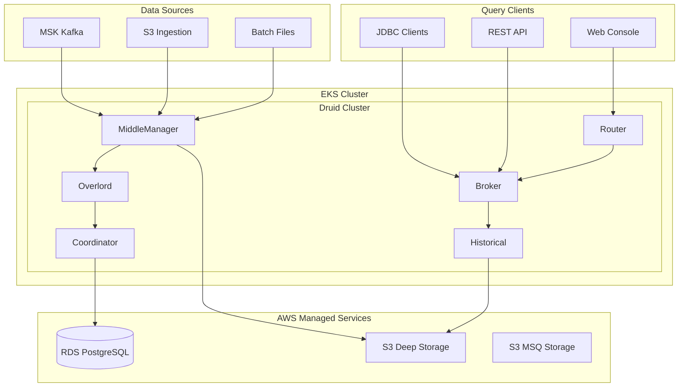
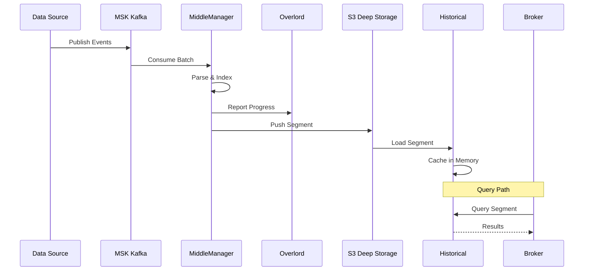
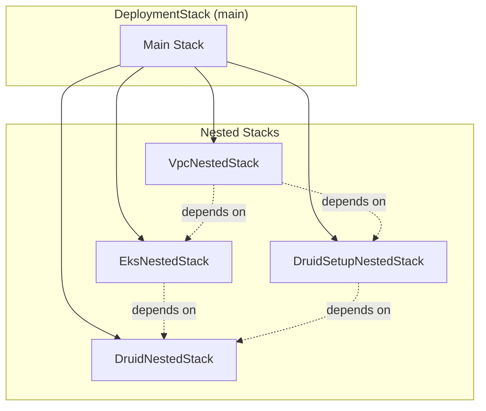
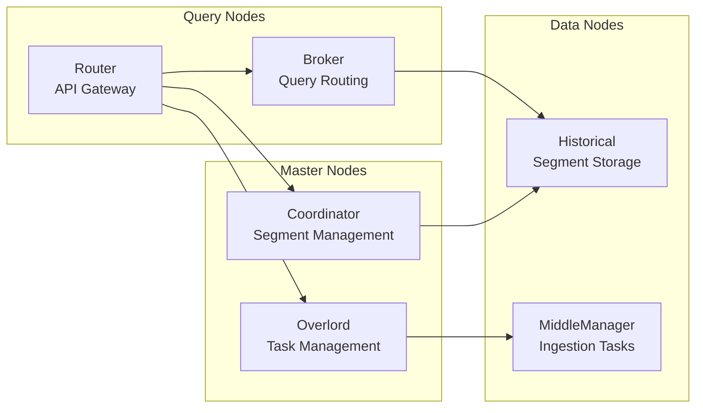

# aws-druid-infra

<div align="center">

*AWS CDK application written in Java that provisions an Apache Druid deployment on Amazon EKS (Elastic Kubernetes Service) with integrated AWS managed services for real-time OLAP analytics at scale.*

[](https://opensource.org/licenses/MIT)
[](https://www.oracle.com/java/)
[](https://aws.amazon.com/cdk/)
[](https://aws.amazon.com/vpc/)
[](https://aws.amazon.com/eks/)
[](https://druid.apache.org/)
[](https://aws.amazon.com/msk/)
[](https://opentelemetry.io/)
[](https://grafana.com/)

</div>

---

## Overview

This CDK application provisions a production-ready [Apache Druid](https://druid.apache.org/) deployment on [Amazon EKS](https://docs.aws.amazon.com/eks/latest/userguide/what-is-eks.html) with fully integrated AWS managed services. Druid is a high-performance, real-time analytics database designed for workflows where fast queries and ingest are critical. The architecture follows [EKS Best Practices](https://aws.github.io/aws-eks-best-practices/) and [Analytics Lens](https://docs.aws.amazon.com/wellarchitected/latest/analytics-lens/analytics-lens.html) recommendations.

### Key Features

| Feature | Description | Reference |
|---------|-------------|-----------|
| **EKS Cluster** | Managed Kubernetes control plane with RBAC configuration | [EKS User Guide](https://docs.aws.amazon.com/eks/latest/userguide/getting-started.html) |
| **AWS Managed Addons** | VPC CNI, EBS CSI, CoreDNS, Kube Proxy, Pod Identity Agent, CloudWatch Container Insights | [EKS Add-ons](https://docs.aws.amazon.com/eks/latest/userguide/eks-add-ons.html) |
| **Helm Chart Addons** | cert-manager, AWS Load Balancer Controller, Karpenter, CSI Secrets Store | [Helm](https://helm.sh/) |
| **Apache Druid** | Real-time OLAP database with sub-second query latency | [Druid Documentation](https://druid.apache.org/docs/latest/) |
| **RDS PostgreSQL** | Managed database for Druid metadata storage | [Amazon RDS](https://docs.aws.amazon.com/AmazonRDS/latest/UserGuide/CHAP_PostgreSQL.html) |
| **S3 Deep Storage** | Scalable object storage for Druid segments | [S3 Deep Storage](https://druid.apache.org/docs/latest/development/extensions-core/s3.html) |
| **MSK (Kafka)** | Managed streaming for real-time data ingestion | [Amazon MSK](https://docs.aws.amazon.com/msk/latest/developerguide/what-is-msk.html) |
| **Grafana Cloud Integration** | Full observability stack with metrics, logs, and traces | [Grafana Cloud](https://grafana.com/products/cloud/) |
| **Managed Node Groups** | Bottlerocket AMIs for enhanced security | [Managed Node Groups](https://docs.aws.amazon.com/eks/latest/userguide/managed-node-groups.html) |

---

## Architecture

### System Overview



### Data Ingestion Flow



### Stack Structure

The Druid infrastructure uses a layered architecture with [CloudFormation nested stacks](https://docs.aws.amazon.com/AWSCloudFormation/latest/UserGuide/using-cfn-nested-stacks.html):



**Dependency Chain**:

1. VPC is created first (network foundation)
2. EKS cluster is provisioned (independent of Druid setup)
3. Druid setup creates supporting resources (RDS, S3, MSK) that depend on VPC
4. Druid Helm chart is deployed after both EKS and setup are ready

### Apache Druid Components



[Apache Druid](https://druid.apache.org/docs/latest/design/architecture.html) consists of several specialized node types:

| Node Type | Purpose | Reference |
|-----------|---------|-----------|
| **Coordinator** | Manages data availability and segment distribution | [Coordinator Process](https://druid.apache.org/docs/latest/design/coordinator.html) |
| **Overlord** | Controls data ingestion workload assignment | [Overlord Process](https://druid.apache.org/docs/latest/design/overlord.html) |
| **Broker** | Handles queries from external clients | [Broker Process](https://druid.apache.org/docs/latest/design/broker.html) |
| **Router** | Routes requests to Brokers, Coordinators, and Overlords | [Router Process](https://druid.apache.org/docs/latest/design/router.html) |
| **Historical** | Stores and queries historical data segments | [Historical Process](https://druid.apache.org/docs/latest/design/historical.html) |
| **MiddleManager** | Executes submitted ingestion tasks | [MiddleManager Process](https://druid.apache.org/docs/latest/design/middlemanager.html) |

### AWS Service Integration

| Service | Druid Component | Purpose | Reference |
|---------|-----------------|---------|-----------|
| **RDS PostgreSQL** | Metadata Storage | Stores segment metadata, rules, and configuration | [Metadata Storage](https://druid.apache.org/docs/latest/dependencies/metadata-storage.html) |
| **S3** | Deep Storage | Long-term segment storage for Historical nodes | [Deep Storage](https://druid.apache.org/docs/latest/dependencies/deep-storage.html) |
| **S3** | Multi-Stage Query | Intermediate storage for MSQ engine | [MSQ](https://druid.apache.org/docs/latest/multi-stage-query/) |
| **MSK (Kafka)** | Real-time Ingestion | Streaming data source for Druid supervisors | [Kafka Ingestion](https://druid.apache.org/docs/latest/development/extensions-core/kafka-ingestion.html) |

### Observability Stack

The cluster integrates with [Grafana Cloud](https://grafana.com/products/cloud/) for comprehensive observability:

| Component | Purpose | Reference |
|-----------|---------|-----------|
| **Prometheus** | Druid and Kubernetes metrics collection | [Grafana Mimir](https://grafana.com/oss/mimir/) |
| **Loki** | Log aggregation from all Druid processes | [Grafana Loki](https://grafana.com/oss/loki/) |
| **Tempo** | Distributed tracing for query analysis | [Grafana Tempo](https://grafana.com/oss/tempo/) |
| **Pyroscope** | Continuous profiling for performance optimization | [Grafana Pyroscope](https://grafana.com/oss/pyroscope/) |
| **OpenTelemetry Collector** | Telemetry data collection and export | [OpenTelemetry](https://opentelemetry.io/) |

### Platform Integration

When deployed through the Fastish platform, this infrastructure integrates with internal platform services:

| Platform Component | Integration Point | Purpose |
|--------------------|-------------------|---------|
| **Orchestrator** | Release pipeline automation | Automated CDK synthesis and deployment via CodePipeline |
| **Portal** | Subscriber management | Tenant provisioning, cluster access control |
| **Network** | Shared VPC infrastructure | Cross-stack connectivity for platform services |
| **Reporting** | Usage metering | Pipeline execution tracking and cost attribution |

These integrations are managed automatically when deploying via the platform's release workflows.

---

## Prerequisites

| Requirement | Version | Installation |
|-------------|---------|--------------|
| **Java** | 21+ | [SDKMAN](https://sdkman.io/) |
| **Maven** | 3.8+ | [Maven Download](https://maven.apache.org/download.cgi) |
| **AWS CLI** | 2.x | [AWS CLI Install](https://docs.aws.amazon.com/cli/latest/userguide/getting-started-install.html) |
| **AWS CDK CLI** | 2.221.0+ | [CDK Getting Started](https://docs.aws.amazon.com/cdk/v2/guide/getting-started.html) |
| **kubectl** | 1.28+ | [kubectl Install](https://kubernetes.io/docs/tasks/tools/) |
| **Helm** | 3.x | [Helm Install](https://helm.sh/docs/intro/install/) |
| **Docker** | Latest | [Docker Install](https://docs.docker.com/get-docker/) |
| **GitHub CLI** | Latest | [GitHub CLI](https://cli.github.com/) |
| **Grafana Cloud Account** | - | [Grafana Cloud](https://grafana.com/products/cloud/) |

**AWS CDK Bootstrap**:

```bash
cdk bootstrap aws://<account-id>/<region>
```

> Replace `<account-id>` with your AWS account ID and `<region>` with your desired AWS region (e.g., `us-west-2`).
> This sets up necessary resources for CDK deployments including an S3 bucket for assets and CloudFormation execution roles.
> See: [CDK Bootstrapping](https://docs.aws.amazon.com/cdk/v2/guide/bootstrapping.html) | [Bootstrap CLI Reference](https://docs.aws.amazon.com/cdk/v2/guide/ref-cli-cmd-bootstrap.html)

---

## Deployment

### Step 1: Clone Repositories

```bash
gh repo clone fast-ish/cdk-common
gh repo clone fast-ish/aws-druid-infra
```

### Step 2: Build Projects

```bash
mvn -f cdk-common/pom.xml clean install
mvn -f aws-druid-infra/pom.xml clean install
```

### Step 3: Prepare Apache Druid Artifacts (Optional)

If using custom Druid images or Helm charts, prepare the artifacts in [Amazon ECR](https://docs.aws.amazon.com/AmazonECR/latest/userguide/what-is-ecr.html):

#### Docker Image

```bash
# Authenticate to ECR
aws ecr get-login-password --region <region> | \
  docker login --username AWS --password-stdin <account-id>.dkr.ecr.<region>.amazonaws.com

# Create repository
aws ecr create-repository \
  --repository-name fasti.sh/v1/docker/druid \
  --region <region> \
  --image-scanning-configuration scanOnPush=true

# Build and push image
docker buildx build --provenance=false --platform linux/amd64 -f Dockerfile.druid \
  -t <account-id>.dkr.ecr.<region>.amazonaws.com/fasti.sh/v1/docker/druid:$(date +'%Y%m%d') \
  -t <account-id>.dkr.ecr.<region>.amazonaws.com/fasti.sh/v1/docker/druid:v1 \
  -t <account-id>.dkr.ecr.<region>.amazonaws.com/fasti.sh/v1/docker/druid:latest \
  --push .
```

See: [ECR User Guide](https://docs.aws.amazon.com/AmazonECR/latest/userguide/getting-started-cli.html)

#### Helm Chart

```bash
# Authenticate Helm to ECR
aws ecr get-login-password --region <region> | \
  helm registry login --username AWS --password-stdin <account-id>.dkr.ecr.<region>.amazonaws.com

# Create repository for Helm charts
aws ecr create-repository \
  --repository-name fasti.sh/v1/helm/druid \
  --region <region> \
  --image-scanning-configuration scanOnPush=true \
  --encryption-configuration encryptionType=AES256

# Package and push chart
helm package ./helm/chart/druid
helm push druid-<version>.tgz oci://<account-id>.dkr.ecr.<region>.amazonaws.com/fasti.sh/v1/helm
```

See: [Helm OCI Support](https://helm.sh/docs/topics/registries/)

#### Update Artifact References

Update the Docker image reference in `src/main/resources/prototype/v1/druid/values.mustache`:

| Parameter | Description | Example |
|-----------|-------------|---------|
| `image.repository` | ECR repository for Druid Docker image | `000000000000.dkr.ecr.us-west-2.amazonaws.com/fasti.sh/v1/docker/druid` |
| `image.tag` | Tag of the Druid Docker image | `v1`, `latest`, or date tag |
| `image.pullPolicy` | Pull policy for the Docker image | `IfNotPresent` |

Update the Helm chart reference in `src/main/resources/prototype/v1/conf.mustache`:

| Parameter | Description | Example |
|-----------|-------------|---------|
| `chart.repository` | ECR repository for Druid Helm chart | `oci://000000000000.dkr.ecr.us-west-2.amazonaws.com/fasti.sh/v1/helm` |
| `chart.name` | Name of the Druid Helm chart | `druid` |
| `chart.version` | Version of the Druid Helm chart | `34.0.0` |

### Step 4: Configure Deployment

Create `aws-druid-infra/cdk.context.json` from `aws-druid-infra/cdk.context.template.json`:

**Required Configuration Parameters**:

| Parameter | Description | Example |
|-----------|-------------|---------|
| `:account` | AWS account ID (12-digit number) | `123456789012` |
| `:region` | AWS region for deployment | `us-west-2` |
| `:domain` | Registered domain name (optional) | `example.com` |
| `:environment` | Environment name (do not change) | `prototype` |
| `:version` | Resource version identifier | `v1` |

**Notes**:
- `:environment` and `:version` map to resource files at `aws-druid-infra/src/main/resources/prototype/v1`
- These values determine which configuration templates are loaded during CDK synthesis

### Step 5: Configure Grafana Cloud

Add [Grafana Cloud](https://grafana.com/docs/grafana-cloud/) configuration for observability:

```json
{
  "hosted:eks:grafana:instanceId": "000000",
  "hosted:eks:grafana:key": "glc_xyz",
  "hosted:eks:grafana:lokiHost": "https://logs-prod-000.grafana.net",
  "hosted:eks:grafana:lokiUsername": "000000",
  "hosted:eks:grafana:prometheusHost": "https://prometheus-prod-000-prod-us-west-0.grafana.net",
  "hosted:eks:grafana:prometheusUsername": "0000000",
  "hosted:eks:grafana:tempoHost": "https://tempo-prod-000-prod-us-west-0.grafana.net/tempo",
  "hosted:eks:grafana:tempoUsername": "000000",
  "hosted:eks:grafana:pyroscopeHost": "https://profiles-prod-000.grafana.net:443"
}
```

**Grafana Cloud Setup**:

1. **Create Account**: Sign up at [grafana.com](https://grafana.com/)
2. **Create Stack**: Navigate to your stack settings
3. **Generate API Key**: Create key with required permissions

| Parameter | Location | Description |
|-----------|----------|-------------|
| `instanceId` | Stack details page | Unique identifier for your Grafana instance |
| `key` | API keys section | API key with all permissions (starts with `glc_`) |
| `lokiHost` | Logs > Data Sources > Loki | Endpoint URL for logs |
| `lokiUsername` | Logs > Data Sources > Loki | Account identifier for Loki |
| `prometheusHost` | Metrics > Data Sources > Prometheus | Endpoint URL for metrics |
| `prometheusUsername` | Metrics > Data Sources > Prometheus | Account identifier for Prometheus |
| `tempoHost` | Traces > Data Sources > Tempo | Endpoint URL for traces |
| `tempoUsername` | Traces > Data Sources > Tempo | Account identifier for Tempo |
| `pyroscopeHost` | Profiles > Connect a Data Source | Endpoint URL for profiling |

**Required API Key Permissions**:

| Permission | Access | Purpose |
|------------|--------|---------|
| `metrics` | Read/Write | Prometheus metrics ingestion |
| `logs` | Read/Write | Loki log ingestion |
| `traces` | Read/Write | Tempo trace ingestion |
| `profiles` | Read/Write | Pyroscope profiling data |
| `alerts` | Read/Write | Alerting configuration |
| `rules` | Read/Write | Recording and alerting rules |

See: [Grafana Cloud Kubernetes Monitoring](https://grafana.com/docs/grafana-cloud/monitor-infrastructure/kubernetes-monitoring/)

### Step 6: Configure Cluster Access

Add IAM role mappings in `cdk.context.json` for [EKS access entries](https://docs.aws.amazon.com/eks/latest/userguide/access-entries.html):

```json
{
  "hosted:eks:administrators": [
    {
      "username": "administrator",
      "role": "arn:aws:iam::000000000000:role/AWSReservedSSO_AdministratorAccess_abc",
      "email": "admin@example.com"
    }
  ],
  "hosted:eks:users": [
    {
      "username": "user",
      "role": "arn:aws:iam::000000000000:role/AWSReservedSSO_DeveloperAccess_abc",
      "email": "user@example.com"
    }
  ]
}
```

| Parameter | Description | Reference |
|-----------|-------------|-----------|
| `administrators` | IAM roles with full cluster admin access | [Cluster Admin](https://docs.aws.amazon.com/eks/latest/userguide/grant-k8s-access.html) |
| `users` | IAM roles with read-only cluster access | [RBAC Authorization](https://kubernetes.io/docs/reference/access-authn-authz/rbac/) |
| `username` | Identifier for the user in Kubernetes RBAC | [User Mapping](https://docs.aws.amazon.com/eks/latest/userguide/add-user-role.html) |
| `role` | AWS IAM role ARN (typically from [AWS IAM Identity Center](https://docs.aws.amazon.com/singlesignon/latest/userguide/what-is.html)) | [IAM Roles](https://docs.aws.amazon.com/IAM/latest/UserGuide/id_roles.html) |
| `email` | For identification and traceability | - |

### Step 7: Deploy Infrastructure

```bash
cd aws-druid-infra

# Preview changes
cdk synth

# Deploy all stacks
cdk deploy
```

See: [CDK Deploy Command](https://docs.aws.amazon.com/cdk/v2/guide/ref-cli-cmd-deploy.html) | [CDK Synth Command](https://docs.aws.amazon.com/cdk/v2/guide/ref-cli-cmd-synth.html)

**What Gets Deployed**:

| Resource Type | Count | Description | Reference |
|---------------|-------|-------------|-----------|
| CloudFormation Stacks | 5 | 1 main + 4 nested stacks | [Nested Stacks](https://docs.aws.amazon.com/AWSCloudFormation/latest/UserGuide/using-cfn-nested-stacks.html) |
| VPC | 1 | Multi-AZ with public/private subnets | [VPC Documentation](https://docs.aws.amazon.com/vpc/latest/userguide/what-is-amazon-vpc.html) |
| EKS Cluster | 1 | Kubernetes 1.28+ control plane | [EKS Clusters](https://docs.aws.amazon.com/eks/latest/userguide/clusters.html) |
| RDS PostgreSQL | 1 | Druid metadata database | [RDS PostgreSQL](https://docs.aws.amazon.com/AmazonRDS/latest/UserGuide/CHAP_PostgreSQL.html) |
| S3 Buckets | 2 | Deep storage + MSQ intermediate | [S3 User Guide](https://docs.aws.amazon.com/AmazonS3/latest/userguide/Welcome.html) |
| MSK Cluster | 1 | Kafka for real-time ingestion | [Amazon MSK](https://docs.aws.amazon.com/msk/latest/developerguide/what-is-msk.html) |
| Managed Node Groups | 1+ | Bottlerocket-based worker nodes | [Managed Node Groups](https://docs.aws.amazon.com/eks/latest/userguide/managed-node-groups.html) |
| Druid Deployment | 1 | All Druid node types via Helm | [Druid Helm Chart](https://druid.apache.org/docs/latest/tutorials/kubernetes.html) |

### Step 8: Access the Cluster

```bash
# Update kubeconfig
aws eks update-kubeconfig --name <cluster-name> --region <region>

# Verify cluster connectivity
kubectl get nodes
kubectl get pods -A

# Check Druid pods
kubectl get pods -n druid
```

See: [Connecting to EKS](https://docs.aws.amazon.com/eks/latest/userguide/create-kubeconfig.html)

---

## Configuration Reference

### CDK Context Variables

The build process uses [Mustache templating](https://mustache.github.io/) to inject context variables into configuration files. See [cdk-common](https://github.com/fast-ish/cdk-common) for the complete build process documentation.

| Variable | Type | Description |
|----------|------|-------------|
| `{{account}}` | String | AWS account ID |
| `{{region}}` | String | AWS region |
| `{{environment}}` | String | Environment name |
| `{{version}}` | String | Resource version |
| `{{hosted:id}}` | String | Unique deployment identifier |

### Template Structure

```
src/main/resources/
└── prototype/
    └── v1/
        ├── conf.mustache           # Main configuration
        ├── eks/
        │   ├── cluster.mustache    # EKS cluster configuration
        │   ├── addons.mustache     # Managed addons
        │   └── nodegroups.mustache # Node group configuration
        ├── druid/
        │   ├── values.mustache     # Druid Helm chart values
        │   ├── rds.mustache        # RDS configuration
        │   ├── s3.mustache         # S3 bucket configuration
        │   └── msk.mustache        # MSK cluster configuration
        ├── helm/
        │   ├── karpenter.mustache  # Karpenter values
        │   └── monitoring.mustache # Grafana stack values
        └── iam/
            └── roles.mustache      # IAM role definitions
```

---

## Druid Operations

### Accessing the Druid Console

The Druid Router provides a web console for administration:

```bash
# Port-forward to Druid Router
kubectl port-forward svc/druid-router 8888:8888 -n druid

# Access console at http://localhost:8888
```

See: [Druid Web Console](https://druid.apache.org/docs/latest/operations/web-console.html)

### Ingesting Data from Kafka

Create a [Kafka ingestion supervisor](https://druid.apache.org/docs/latest/development/extensions-core/kafka-supervisor.html) to stream data:

```json
{
  "type": "kafka",
  "spec": {
    "dataSchema": {
      "dataSource": "my-datasource",
      "timestampSpec": {
        "column": "timestamp",
        "format": "auto"
      },
      "dimensionsSpec": {
        "dimensions": ["dimension1", "dimension2"]
      }
    },
    "ioConfig": {
      "type": "kafka",
      "consumerProperties": {
        "bootstrap.servers": "<msk-bootstrap-servers>"
      },
      "topic": "my-topic"
    }
  }
}
```

See: [Kafka Ingestion](https://druid.apache.org/docs/latest/development/extensions-core/kafka-ingestion.html)

### Querying Data

Druid supports multiple query languages:

| Method | Description | Reference |
|--------|-------------|-----------|
| **Druid SQL** | SQL-compatible queries via Broker | [Druid SQL](https://druid.apache.org/docs/latest/querying/sql.html) |
| **Native Queries** | JSON-based query format | [Native Queries](https://druid.apache.org/docs/latest/querying/querying.html) |
| **JDBC** | Standard JDBC driver connectivity | [JDBC Driver](https://druid.apache.org/docs/latest/querying/sql-jdbc.html) |

---

## Security Considerations

| Aspect | Implementation | Reference |
|--------|----------------|-----------|
| **Node AMI** | Bottlerocket for minimal attack surface | [Bottlerocket](https://aws.amazon.com/bottlerocket/) |
| **Pod Identity** | IAM roles for service accounts | [Pod Identity](https://docs.aws.amazon.com/eks/latest/userguide/pod-identities.html) |
| **Network Policies** | VPC CNI for pod-level network isolation | [Network Policies](https://docs.aws.amazon.com/eks/latest/userguide/cni-network-policy.html) |
| **Secrets Management** | CSI Secrets Store with AWS Secrets Manager | [Secrets Store](https://docs.aws.amazon.com/secretsmanager/latest/userguide/integrating_csi_driver.html) |
| **RDS Encryption** | Encryption at rest with KMS | [RDS Encryption](https://docs.aws.amazon.com/AmazonRDS/latest/UserGuide/Overview.Encryption.html) |
| **S3 Encryption** | Server-side encryption (SSE-S3) | [S3 Encryption](https://docs.aws.amazon.com/AmazonS3/latest/userguide/serv-side-encryption.html) |
| **MSK Encryption** | TLS in transit, KMS at rest | [MSK Encryption](https://docs.aws.amazon.com/msk/latest/developerguide/msk-encryption.html) |

See: [EKS Best Practices Guide - Security](https://aws.github.io/aws-eks-best-practices/security/docs/)

---

## Troubleshooting

### Quick Diagnostics

```bash
# Check CDK synthesis
cdk synth --quiet 2>&1 | head -20

# Verify CloudFormation stack status
aws cloudformation describe-stacks --stack-name <stack-name> \
  --query 'Stacks[0].StackStatus'

# Check EKS cluster status
aws eks describe-cluster --name <cluster-name> \
  --query 'cluster.status'

# Verify Druid pods
kubectl get pods -n druid
kubectl describe pod <druid-pod> -n druid

# Check Druid logs
kubectl logs -l app=druid-coordinator -n druid --tail=50
kubectl logs -l app=druid-broker -n druid --tail=50

# Verify RDS connectivity
kubectl run pg-test --rm -it --image=postgres:15 -- \
  psql -h <rds-endpoint> -U druid -d druid -c "SELECT 1"

# Check MSK cluster status
aws kafka describe-cluster --cluster-arn <msk-arn> \
  --query 'ClusterInfo.State'

# Test Kafka connectivity from pod
kubectl exec -it <druid-middlemanager-pod> -n druid -- \
  kafka-broker-api-versions --bootstrap-server <msk-bootstrap>:9092
```

### Common Issues

| Issue | Symptom | Resolution |
|-------|---------|------------|
| RDS connection timeout | Druid coordinator fails to start | Verify security group allows port 5432 from EKS nodes |
| MSK authentication failure | MiddleManager ingestion errors | Check IAM role permissions for MSK access |
| S3 deep storage errors | Segment handoff failures | Verify S3 bucket policy and IAM permissions |
| Druid OOM | Historical/MiddleManager pod restarts | Increase memory limits in values.yaml |
| Grafana no metrics | Empty dashboards | Verify Grafana Cloud credentials in cdk.context.json |

For detailed troubleshooting procedures, see the [Troubleshooting Guide](https://fast-ish.github.io/docs/TROUBLESHOOTING.html).

---

## Related Documentation

### Platform Documentation

| Resource | Description |
|----------|-------------|
| [Fastish Documentation](https://fast-ish.github.io/) | Platform documentation home |
| [cdk-common](https://github.com/fast-ish/cdk-common) | Shared CDK constructs library |
| [Troubleshooting Guide](https://fast-ish.github.io/docs/TROUBLESHOOTING.html) | Common issues and solutions |
| [Validation Guide](https://fast-ish.github.io/docs/VALIDATION.html) | Deployment validation procedures |
| [Upgrade Guide](https://fast-ish.github.io/docs/UPGRADE.html) | Upgrade and rollback procedures |
| [Capacity Planning](https://fast-ish.github.io/docs/CAPACITY-PLANNING.html) | Sizing and cost guidance |
| [IAM Permissions](https://fast-ish.github.io/docs/IAM-PERMISSIONS.html) | Minimum required permissions |
| [Network Requirements](https://fast-ish.github.io/docs/NETWORK-REQUIREMENTS.html) | CIDR, ports, and security groups |
| [Glossary](https://fast-ish.github.io/GLOSSARY.html) | Platform terminology |
| [Changelog](https://fast-ish.github.io/CHANGELOG.html) | Version history |

### AWS Documentation

| Resource | Description |
|----------|-------------|
| [EKS User Guide](https://docs.aws.amazon.com/eks/latest/userguide/what-is-eks.html) | Official EKS documentation |
| [EKS Best Practices](https://aws.github.io/aws-eks-best-practices/) | AWS EKS best practices guide |
| [Analytics Lens](https://docs.aws.amazon.com/wellarchitected/latest/analytics-lens/analytics-lens.html) | Analytics architecture guidance |
| [Amazon MSK Developer Guide](https://docs.aws.amazon.com/msk/latest/developerguide/what-is-msk.html) | MSK documentation |
| [MSK Best Practices](https://docs.aws.amazon.com/msk/latest/developerguide/bestpractices.html) | MSK configuration guidance |
| [Amazon RDS User Guide](https://docs.aws.amazon.com/AmazonRDS/latest/UserGuide/Welcome.html) | RDS documentation |
| [S3 Best Practices](https://docs.aws.amazon.com/AmazonS3/latest/userguide/optimizing-performance.html) | S3 performance optimization |

### Apache Druid Documentation

| Resource | Description |
|----------|-------------|
| [Apache Druid Documentation](https://druid.apache.org/docs/latest/) | Official Druid documentation |
| [Druid Architecture](https://druid.apache.org/docs/latest/design/architecture.html) | Druid design and components |
| [Druid Tuning Guide](https://druid.apache.org/docs/latest/operations/basic-cluster-tuning.html) | Performance optimization |

### Observability

| Resource | Description |
|----------|-------------|
| [Grafana Cloud Docs](https://grafana.com/docs/grafana-cloud/) | Grafana Cloud documentation |
| [OpenTelemetry Documentation](https://opentelemetry.io/docs/) | Telemetry collection framework |

---

## License

[MIT License](LICENSE)

For your convenience, you can find the full MIT license text at:
- [https://opensource.org/license/mit/](https://opensource.org/license/mit/) (Official OSI website)
- [https://choosealicense.com/licenses/mit/](https://choosealicense.com/licenses/mit/) (Choose a License website)
